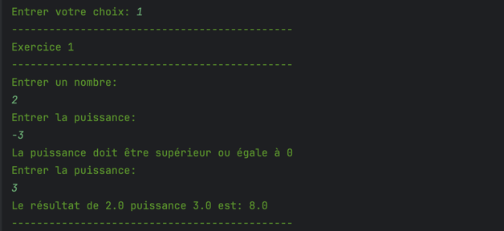
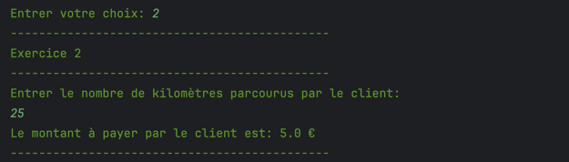
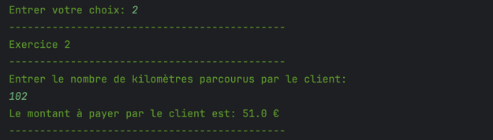
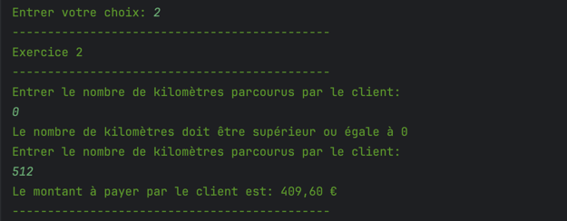
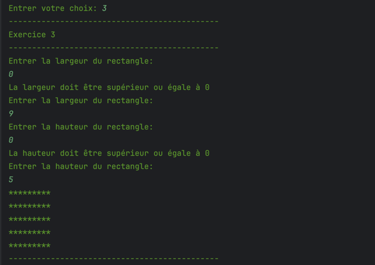
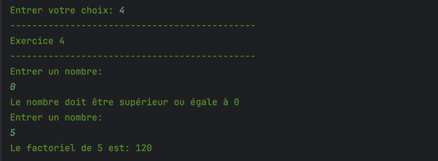

# JAVA EVAL1 SIO 1 : Coding Challenge 1
[]()

## Travail à faire

### Exercice 1 (5 points)
Ecrire un programme qui permet calculer la puissance d'un nombre. 

Le programme demande à l'utilisateur de saisir un nombre et sa puissance et affiche le résultat de la puissance du nombre saisi.
    
#### Résultat attendu



#### Aide
```java
// Un peu d'aide, pour calculer une puissance, java disponse de la méthode Math.pow
// Exemple d'utilisation
double resultat = Math.pow(2, 2); // resultat = 4
```

### Exercice 2 (5 points)
Ecrire un programme qui demande le nombre de kilomètres parcourus par un client ayant loué une voiture et 
qui calcule les frais kilométriques correspondants.

La règle de calcul est la suivante :
- 0.20 € par kilomètre si le client a parcouru moins de 100 kilomètres
- 0.50 € par kilomètre si le client a parcouru entre 100 et 500 kilomètres
- 0.80 € par kilomètre si le client a parcouru plus de 500 kilomètres

#### Résultat attendu







### Exercice 3 (5 points)
Ecrire un programme qui dessine un rectangle de largeur et de hauteur saisies par l'utilisateur.




### Exercice 4 (5 points)
Ecrire un programme qui calcule la factorielle d'un nombre saisi par l'utilisateur.

Pour rappel, la factorielle d'un nombre n est le produit de tous les entiers de 1 à n. Par exemple, la factorielle de 5 est 5 * 4 * 3 * 2 * 1 = 120.


